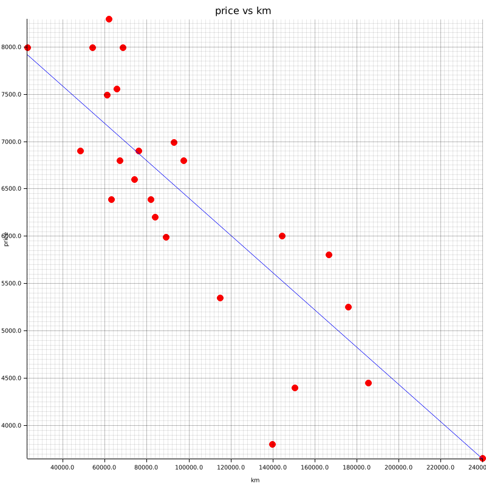

# ft_linear_regression
#### A simple Rust linear regression implementation 

#### Usage :
```bash
<executable> <path_to_csv_dataset> <path_to_target_chart> <chart_width> <chart_height>
```
#### An Exemple with the 42 subject dataset

